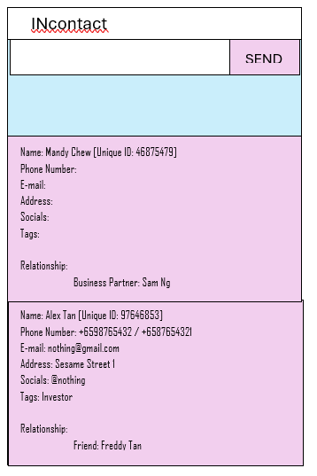

* This project is based on the AddressBook-Level3 project created by the [SE-EDU initiative](https://se-education.org).

# INcontact
**Incontact** a software designed to help early startup better manage their contacts and relationships.
