## Table of Contents
* [Acknowledgements](#acknowledgements)
* [Setting up, getting started](#setting-up-getting-started)
* [Design](#design)
  * [Architecture](#architecture)
  * [UI component](#ui-component)
  * [Logic component](#logic-component)
  * [Model component](#model-component)
  * [Storage component](#storage-component)
  * [Common classes](#common-classes)
* [Implementation](#implementation)
  * [Relationship Feature: Linking Contacts](#relationship-feature-linking-contacts)
  * [Event Feature: Managing Events](#event-feature-managing-events)
  * [Find Commands with Substring Matching](#find-commands-with-substring-matching)
  * [Sort Command](#sort-command)
  * [Redo Command](#redo-command)
* [Documentation, logging, testing, configuration, dev-ops](#documentation-logging-testing-configuration-dev-ops)
* [Appendix: Requirements](#appendix-requirements)
  * [Product scope](#product-scope)
  * [User stories](#user-stories)
  * [Use cases](#use-cases)
  * [Non-Functional Requirements](#non-functional-requirements)
  * [Glossary](#glossary)
* [Appendix: Instructions for manual testing](#appendix-instructions-for-manual-testing)

--------------------------------------------------------------------------------------------------------------------

## Acknowledgements

* **[Hawking Date/Time Parser](https://github.com/zoho/hawking):** Used for natural language date parsing for Event commands.

--------------------------------------------------------------------------------------------------------------------

## Setting up, getting started

Refer to the guide [_Setting up and getting started_](SettingUp.md).

--------------------------------------------------------------------------------------------------------------------

## Design

### Architecture

The ***Architecture Diagram*** given above explains the high-level design of the App.

Given below is a quick overview of main components and how they interact with each other.

**Main components of the architecture**

**`Main`** (consisting of classes [`Main`](https://github.com/AY2425S2-CS2103T-T09-1/tp/blob/master/src/main/java/seedu/address/Main.java) and [`MainApp`](https://github.com/AY2425S2-CS2103T-T09-1/tp/blob/master/src/main/java/seedu/address/MainApp.java)) is in charge of the app launch and shut down.
* At app launch, it initializes the other components in the correct sequence, and connects them up with each other.
* At shut down, it shuts down the other components and invokes cleanup methods where necessary.

The bulk of the app's work is done by the following four components:

* [**`UI`**](#ui-component): The UI of the App.
* [**`Logic`**](#logic-component): The command executor.
* [**`Model`**](#model-component): Holds the data of the App in memory.
* [**`Storage`**](#storage-component): Reads data from, and writes data to, the hard disk.

[**`Commons`**](#common-classes) represents a collection of classes used by multiple other components.

**How the architecture components interact with each other**

The *Sequence Diagram* below shows how the components interact with each other for the scenario where the user issues the command `delete 1`.

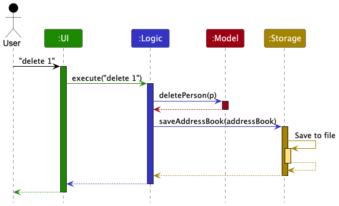

Each of the four main components (also shown in the diagram above),

* defines its *API* in an `interface` with the same name as the Component.
* implements its functionality using a concrete `{Component Name}Manager` class (which follows the corresponding API `interface` mentioned in the previous point.

For example, the `Logic` component defines its API in the `Logic.java` interface and implements its functionality using the `LogicManager.java` class which follows the `Logic` interface. Other components interact with a given component through its interface rather than the concrete class (reason: to prevent outside component's being coupled to the implementation of a component), as illustrated in the (partial) class diagram below.

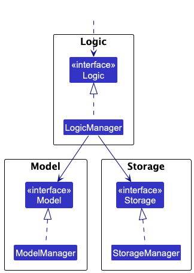

The sections below give more details of each component.

### UI component

The **API** of this component is specified in [`Ui.java`](https://github.com/AY2425S2-CS2103T-T09-1/tp/blob/master/src/main/java/seedu/address/ui/Ui.java)

The UI consists of a `MainWindow` that is made up of parts e.g.`CommandBox`, `ResultDisplay`, `PersonListPanel`, `StatusBarFooter` etc. All these, including the `MainWindow`, inherit from the abstract `UiPart` class which captures the commonalities between classes that represent parts of the visible GUI.

The `UI` component uses the JavaFx UI framework. The layout of these UI parts are defined in matching `.fxml` files that are in the `src/main/resources/view` folder. For example, the layout of the [`MainWindow`](https://github.com/AY2425S2-CS2103T-T09-1/tp/blob/master/src/main/java/seedu/address/ui/MainWindow.java) is specified in [`MainWindow.fxml`](https://github.com/AY2425S2-CS2103T-T09-1/tp/blob/master/src/main/resources/view/MainWindow.fxml)

The `UI` component,

* executes user commands using the `Logic` component.
* listens for changes to `Model` data so that the UI can be updated with the modified data.
* displays `Person` objects, including their associated `Relationship`s and `Tag`s, using the `PersonCard` within the `PersonListPanel`.
* displays `Event` objects using the `EventCard` within the `EventListPanel` (if implemented).
* keeps a reference to the `Logic` component, because the `UI` relies on the `Logic` to execute commands.
* depends on some classes in the `Model` component, as it displays objects residing in the `Model`.

### Logic component

**API** : [`Logic.java`](https://github.com/AY2425S2-CS2103T-T09-1/tp/blob/master/src/main/java/seedu/address/logic/Logic.java)

Here's a (partial) class diagram of the `Logic` component:

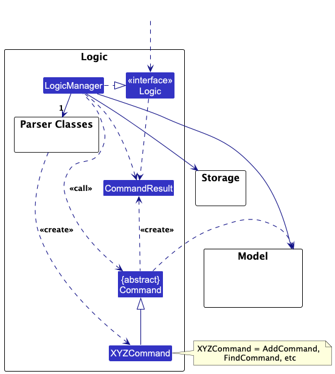

The sequence diagram below illustrates the interactions within the `Logic` component, taking `execute("delete 1")` API call as an example.

:information_source: **Note:** The lifeline for `DeleteCommandParser` should end at the destroy marker (X) but due to a limitation of PlantUML, the lifeline continues till the end of diagram.

How the `Logic` component works:

1. When `Logic` is called upon to execute a command, it is passed to an `AddressBookParser` object which in turn creates a parser that matches the command (e.g., `DeleteCommandParser`, `AddRelationshipCommandParser`) and uses it to parse the command.
1. This results in a `Command` object (more precisely, an object of one of its subclasses e.g., `DeleteCommand`, `AddRelationshipCommand`) which is executed by the `LogicManager`.
1. The command can communicate with the `Model` when it is executed (e.g. to delete a person, add a relationship, add an event). 
   Note that although this is shown as a single step in the diagram above (for simplicity), in the code it can take several interactions (between the command object and the `Model`) to achieve.
1. The result of the command execution is encapsulated as a `CommandResult` object which is returned back from `Logic`.

Here are the other classes in `Logic` (omitted from the class diagram above) that are used for parsing a user command:

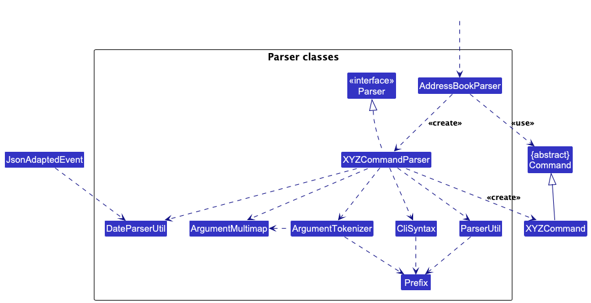

How the parsing works:
* When called upon to parse a user command, the `AddressBookParser` class creates an `XYZCommandParser` (`XYZ` is a placeholder for the specific command name e.g., `AddCommandParser`, `AddRelationshipCommandParser`, `AddEventCommandParser`) which uses the other classes shown above to parse the user command and create a `XYZCommand` object (e.g., `AddCommand`, `AddRelationshipCommand`, `AddEventCommand`) which the `AddressBookParser` returns back as a `Command` object.
* All `XYZCommandParser` classes inherit from the `Parser` interface so that they can be treated similarly where possible e.g, during testing.

#### Parser utilities

* `ParserUtil`: Provides utility methods for parsing common fields like `Name`, `Phone`, `Email`, `Tag`, `Index`, and now also `EventName` and `Contact` (as a `Person`).
* `DateParserUtil`: Uses the Hawking library to provide natural language date parsing capabilities (e.g., "tomorrow", "next Monday", "2025-03-15"). This is used by event-related command parsers.
* `CliSyntax`: Defines the prefixes (e.g., `n/`, `p/`, `u/`, `fn/`, `en/`, `d/`) used in the command line interface.

### Model component
**API** : [`Model.java`](https://github.com/AY2425S2-CS2103T-T09-1/tp/blob/master/src/main/java/seedu/address/model/Model.java)

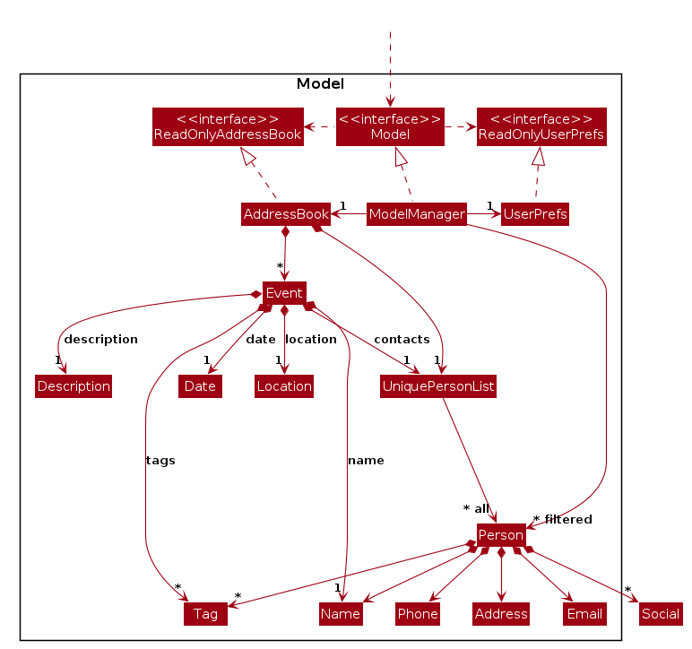

The `Model` component,

* stores the address book data i.e., all `Person` objects (in `UniquePersonList`), `Relationship` objects (in `UniqueRelationshipList`), and `Event` objects (in an `ObservableList`). All these are encapsulated within the `AddressBook` object.
* stores the currently 'selected' objects (e.g., results of a search query) as separate _filtered_ lists (`FilteredList<Person>`, `FilteredList<Relationship>`, `FilteredList<Event>`) which are exposed to outsiders as unmodifiable `ObservableList`s that can be 'observed'.
* stores a `UserPref` object that represents the user’s preferences. This is exposed to the outside as a `ReadOnlyUserPref` object.
* does not depend on any of the other three components.

**Key Data Structures:**

*   **`Person`**: Represents a contact with fields like `Name`, `Phone`, `Email`, `Address`, `Social`, `Tag`s, and a unique `id`.
*   **`Relationship`**: Represents a directed connection between two `Person`s identified by their unique IDs. It has a `forwardName` (e.g., "Boss of"), a `reverseName` (e.g., "Reports to"), and can have `Tag`s (e.g., "Work"). See the [Relationship Feature](#relationship-feature-linking-contacts) section for details.
*   **`Event`**: Represents an event with a `name`, `date` (LocalDateTime), `location`, `description`, `Tag`s, and a list of associated `Person` contacts (`UniquePersonList`). See the [Event Feature](#event-feature-managing-events) section for details.
*   **`UniquePersonList`**: Enforces uniqueness among `Person` objects based on `isSamePerson`.
*   **`UniqueRelationshipList`**: Enforces uniqueness among `Relationship` objects based on `isSameRelationship`.

### Storage component

**API** : [`Storage.java`](https://github.com/AY2425S2-CS2103T-T09-1/tp/blob/master/src/main/java/seedu/address/storage/Storage.java)

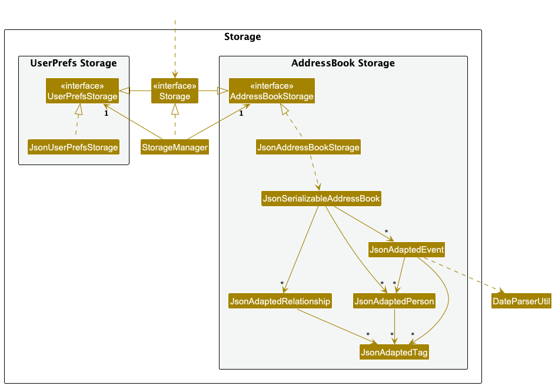

The `Storage` component,
* can save `AddressBook` data (including `Person`s, `Relationship`s, and `Event`s) and `UserPref` data in JSON format, and read them back into corresponding objects.
* uses Jackson-friendly intermediate classes like `JsonAdaptedPerson`, `JsonAdaptedRelationship`, and `JsonAdaptedEvent` to handle the serialization and deserialization process.
* inherits from both `AddressBookStorage` and `UserPrefStorage`.
* depends on some classes in the `Model` component.
* `JsonAdaptedEvent` uses `DateParserUtil` from the Logic component's parser utilities to ensure consistent date handling between user input and stored data. While this increases coupling slightly, it maintains backward compatibility and ensures data integrity.

### Common classes

Classes used by multiple components are in the `seedu.address.commons` package. Examples include logging (`LogsCenter`), core utilities (`Config`, `GuiSettings`, `Version`), exceptions (`DataLoadingException`), and utility classes (`AppUtil`, `StringUtil`, `CollectionUtil`).

--------------------------------------------------------------------------------------------------------------------

## Implementation

This section describes some noteworthy details on how certain features are implemented.

### Relationship Feature: Linking Contacts

The Relationship feature allows users to define connections between contacts.

**Core Components:**

*   **`Relationship` Class:** Stores the core data:
    *   `firstUserId`, `secondUserId`: The unique IDs (`Person::getId`) of the two contacts involved. Using IDs makes the relationship robust against changes in contact details like name or phone.
    *   `forwardName`: The description of the relationship from the perspective of `firstUserId` (e.g., "Parent of").
    *   `reverseName`: The description from the perspective of `secondUserId` (e.g., "Child of"). This allows for asymmetric relationships.
    *   `tags`: A `Set<Tag>` for categorizing the relationship (e.g., "Work", "Family").
*   **`UniqueRelationshipList`:** Manages the collection of `Relationship` objects within the `AddressBook`. It ensures that duplicate relationships (based on the pair of users and the specific forward/reverse names) are not added.
*   **Relationship Commands:** (`addRelationship`, `deleteRelationship`, `addRelationshipTag`, `deleteRelationshipTag`, `findRelationship`) Provide the user interface for interacting with relationships.
*   **Relationship Parsers:** Parse the user input for relationship commands, handling prefixes like `u/` (userId), `fn/` (forward name), `rn/` (reverse name), and `t/` (tag).
*   **UI Display (`PersonCard`)**: Each `PersonCard` in the list displays the relationships relevant to that person. It fetches the relationships involving the person's ID from the `Model` and displays the appropriate relationship name (`forwardName` or `reverseName`) along with the *name* of the other person involved. To get the other person's name, it looks up the other person in the `AddressBook` using their ID.

**Implementation Details:**

*   **Identification:** Relationships are primarily identified by the unique IDs of the two persons involved. When deleting or modifying tags, the user provides both IDs and *one* of the relationship names (either forward or reverse). The system checks against both possibilities (`forwardName` and `reverseName`) to find the correct relationship. See `Relationship::isSameRelationship(String, String, String)`.
*   **Uniqueness:** `UniqueRelationshipList` prevents adding a relationship if another relationship with the exact same pair of IDs and same forward/reverse names already exists (considering both directions).
*   **Display Logic:** The `PersonListPanel` listens for changes in the `ObservableList<Relationship>` from the `Model`. When relationships are added, deleted, or updated (e.g., tags changed), it identifies the `Person` objects involved and triggers a refresh of the `ListView` or specific `PersonCard`s to reflect the changes.

**Sequence Diagrams:**

*   **Adding a Relationship:**
    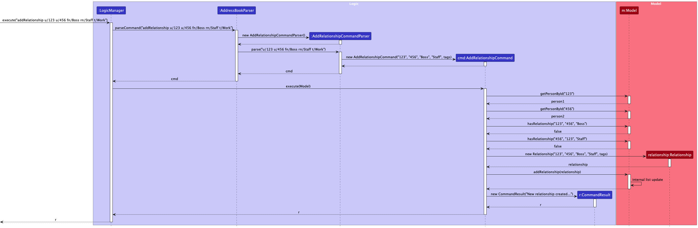
*   **Deleting a Relationship:**
    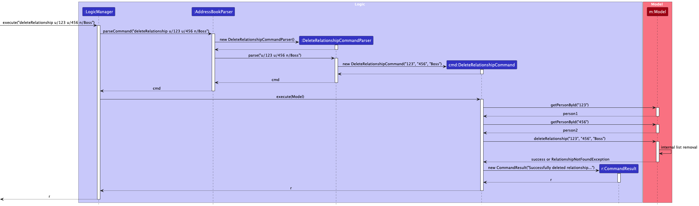
*   **Adding a Tag to a Relationship:**
    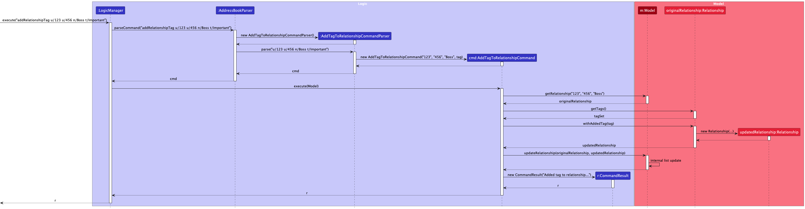
*   **Deleting a Tag from a Relationship:**
    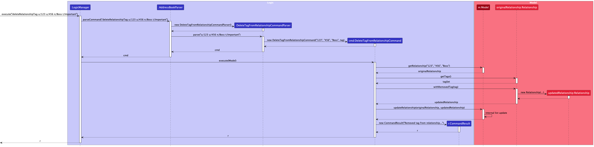

**Class Diagrams for Detail:**

*   
*   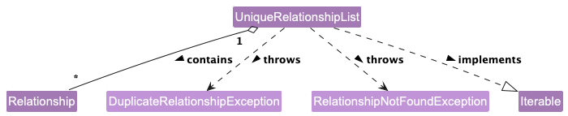
*   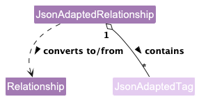

**Design Considerations:**

*   **Alternative 1: Using Person objects directly:** Storing direct references to `Person` objects in `Relationship` would create strong coupling and potential issues if a `Person` object is deleted or modified in ways that affect equality.
    *   *Pros:* Simpler lookup of person details.
    *   *Cons:* Less robust, harder to manage lifecycle, potential memory leaks if references aren't cleared properly.
*   **Alternative 2 (Current Choice): Using Person IDs:** Storing unique, immutable `Person` IDs.
    *   *Pros:* Decouples `Relationship` from `Person` object instances, robust against `Person` updates, easier serialization.
    *   *Cons:* Requires looking up `Person` details (like name) from the `AddressBook` or `Model` when displaying relationships.
*   **Relationship Name Storage:** Using separate `forwardName` and `reverseName` allows representing asymmetric relationships clearly. An alternative could be a single name and a direction flag, but the current approach is arguably more descriptive.

### Event Feature: Managing Events

The Event feature allows users to schedule and manage events, associating contacts with them.

**Core Components:**

*   **`Event` Class:** Stores the event details:
    *   `id`: A unique identifier automatically generated for each event.
    *   `name`: The name of the event.
    *   `date`: The date and time of the event (`LocalDateTime`).
    *   `location`: The physical location of the event (optional).
    *   `description`: A description of the event (optional).
    *   `tags`: A `Set<Tag>` for categorizing the event (e.g., "Meeting", "Conference").
    *   `contacts`: A `UniquePersonList` containing the `Person` objects associated with this event.
*   **`AddressBook`:** Stores the list of all `Event` objects (currently as a simple `ObservableList`).
*   **Event Commands:** (`addEvent`, `deleteEvent`, `addEventContact`, `deleteEventContact`, `addEventTag`, `deleteEventTag`, `updateEventDate`, `updateEventDesc`, `updateEventLoc`) Provide the user interface for managing events.
*   **Event Parsers:** Parse user input for event commands, utilizing `DateParserUtil` for flexible date input.
*   **UI Display (`EventCard`, `EventListPanel`):** (If implemented) Display event information. `EventCard` shows details of a single event. `EventListPanel` shows the list of events.

**Implementation Details:**

*   **Date Handling:** `DateParserUtil` uses the Hawking library to parse natural language dates provided by the user (e.g., "next Friday at 2pm", "2025-04-10 10:00"). The parsed date is stored as a standard `LocalDateTime`.
*   **Contact Association:** Events store references to actual `Person` objects within their internal `UniquePersonList`. When an event is added using `addEvent`, the command parser creates *temporary* `Person` objects based on the names provided (`c/Contact Name`). The `AddEventCommand` then adds the event to the model and iterates through these temporary contacts. For each contact, it adds them to the *event's* contact list and also ensures the contact exists in the main `AddressBook` person list (adding them if necessary with default details). This ensures consistency.
*   **Modification:** Event properties (date, description, location) and associated data (tags, contacts) are modified using specific commands. Adding/removing tags or contacts, or updating properties, typically involves creating a *new* `Event` object with the changes and replacing the old one in the `Model` using `Model::updateEvent`.

**Sequence Diagrams:**

*   **Adding an Event:**
    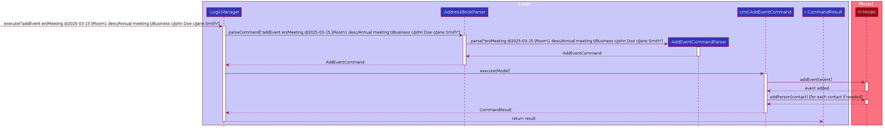
*   **Updating Event Description:**
    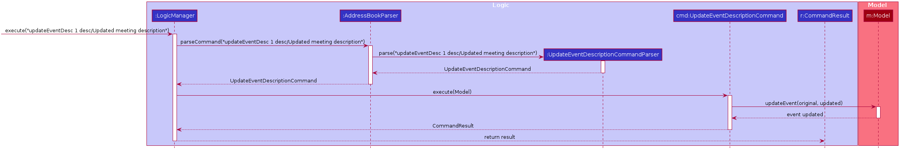
*   **Updating Event Location:**
    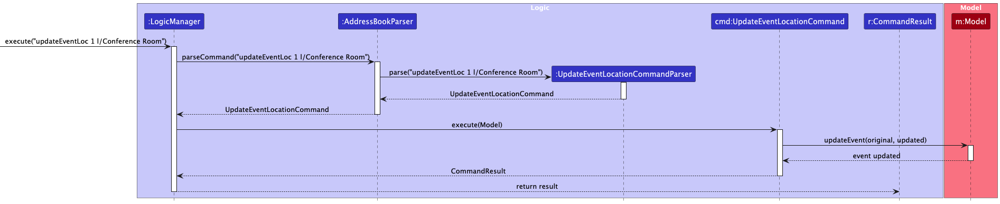
*   **Updating Event Date:**
    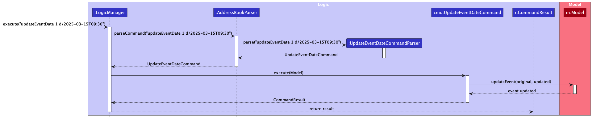
*   **Adding a Tag to an Event:**
    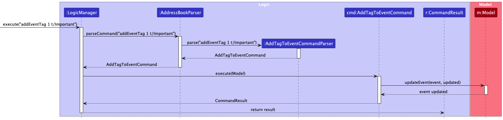
*   **Deleting a Tag from an Event:**
    
*   **Adding a Contact to an Event:**
    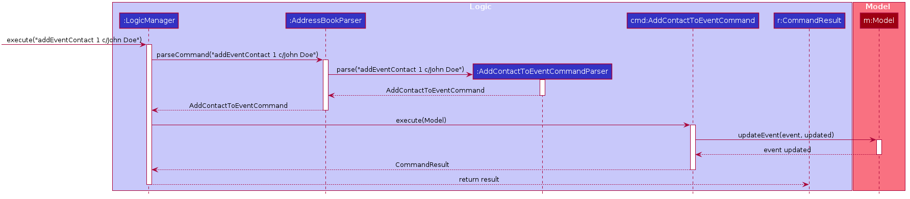
*   **Deleting a Contact from an Event:**
    
*   **Deleting an Event:**
    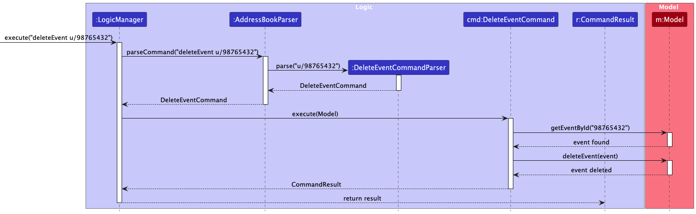

**Design Considerations:**

*   **Event Storage:** Currently uses a standard `ObservableList` in `AddressBook`. A `UniqueEventList` could be implemented if strict uniqueness based on certain criteria (e.g., name and date) is required, though generating a unique ID simplifies this.
*   **Contact Management:** Storing `Person` references directly in the event's list simplifies access to contact details but requires careful handling, especially during deletion (ensuring contacts are not deleted from the main list just because they are removed from an event, and handling cases where a contact associated with an event is deleted from the main list). The current implementation adds contacts to the main list if they don't exist, which is one approach to manage this.

### Find Commands with Substring Matching

The `findName`, `findEmail`, `findPhone`, `findAddress`, `findSocial`, `findTag`, and `findRelationship` commands have been implemented to use case-insensitive *substring* matching instead of full word matching.

*   **Mechanism:** Each `findXYZ` command uses a corresponding `XYZContainsKeywordsAsSubstringPredicate` (e.g., `NameContainsKeywordsAsSubstringPredicate`).
*   **Predicate Logic:** Inside the `test` method of each predicate, it streams through the user-provided keywords. For each keyword, it checks if the relevant field in the `Person` object (e.g., `person.getName().fullName`) contains the keyword as a substring, ignoring case (`toLowerCase().contains(keyword.toLowerCase())`). The predicate returns `true` if *any* keyword matches as a substring within the field.
*   **Example (`findName`):** If a person's name is "Alex Yeoh", `findName Alex` will match, `findName Yeoh` will match, and `findName lex` will also match.
*   **Rationale:** Substring matching provides more flexibility for users who may not remember the exact full name, email, etc., allowing for partial matches.

**Sequence Diagram Example (`findName`):**

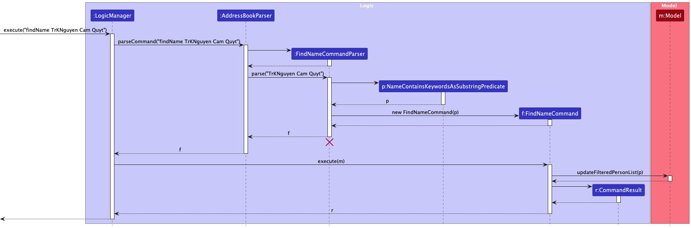

*(Similar diagrams exist for other find commands like `findEmail`, `findPhone`, etc.)*

### Sort Command

The `sort` command allows sorting the displayed person list based on one or more fields (`name`, `phone`, `email`, `address`, `tags`, `socials`). Field names are case-insensitive, so both `sort name` and `sort Name` will work the same way.

*   **Mechanism:** The `SortCommandParser` parses the field names and an optional `-r` flag for reverse order. The `SortCommand` then creates a `Comparator<Person>` based on the specified fields.
*   **Comparator Creation:** It starts with a comparator for the first field. For subsequent fields, it uses `thenComparing` to chain the sorting criteria. String fields (`name`, `phone`, `email`, `address`) use case-insensitive comparison. Collection fields (`tags`, `socials`) are compared using their string representation (HashSet's `toString()` method), which means sorting is based on the lexicographical comparison of their string values rather than individual elements or properties of the sets.
*   **Execution:** The `SortCommand` calls `Model.updateSortedPersonList(comparator)`, which in turn calls `AddressBook.sortPersons(comparator)`. This sorts the underlying `UniquePersonList` within the `AddressBook`. Since the `FilteredList` in `ModelManager` wraps the `ObservableList` from `AddressBook`, changes in the source list's order are reflected in the filtered/sorted list displayed in the UI.

**Sequence Diagram:**

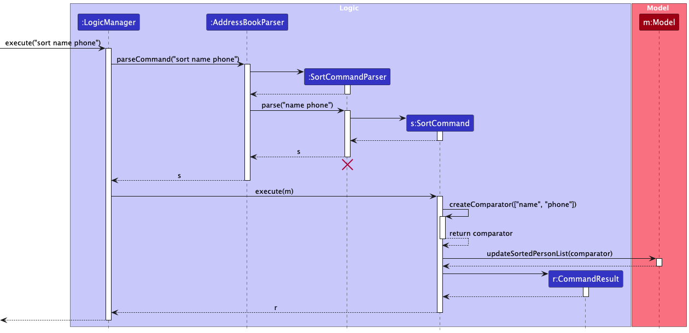

### Redo Command and Redo List Command

The `redo` and `redoList` commands allow users to re-execute or view recently executed commands.

*   **`CommandHistory` Class:** A static class (`seedu.address.model.commandhistory.CommandHistory`) maintains a `Deque<String>` (double-ended queue) called `lastCommands`. This history is session-based and does not persist between program executions; it is initialized as empty when the application starts and cleared when the application is terminated.
*   **Adding Commands:** After a command is successfully parsed and *before* it's executed by `LogicManager`, the original command string is added to the front of the `lastCommands` deque using `CommandHistory.addCommandToHistory(userInput)`. If the deque size exceeds 10, the oldest command (at the end) is removed. Commands like `redo` itself are not added to the history to prevent recursive loops.
*   **`redoList` Command:** This command retrieves all commands from the `CommandHistory` deque and formats them into a numbered list for display to the user (currently thrown as a `CommandException` for display). The list only shows successfully executed commands from the current session, up to a maximum of 10 commands.
*   **`redo N` Command:**
    1.  Parses the integer `N`.
    2.  Validates `N` (must be between 1 and 10).
    3.  Retrieves the Nth command string from the `CommandHistory` using `CommandHistory.getCommandFromHistory(N)`.
    4.  Creates a *new* `AddressBookParser` instance.
    5.  Calls `parseCommand` on the retrieved command string.
    6.  Executes the resulting `Command` object. The result of *this* execution is returned to the user.

Sequence Diagram for Redo Command:
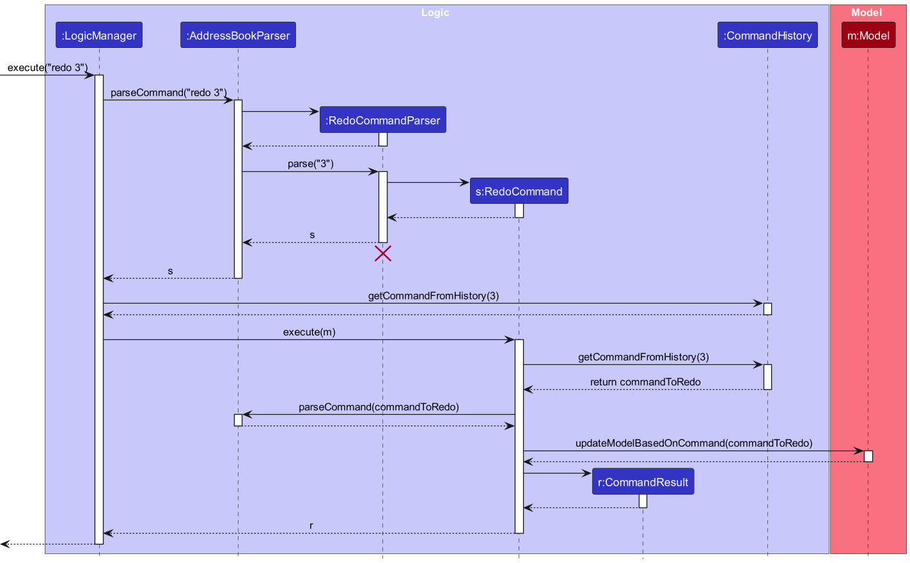

Sequence Diagram for Redo List Command:
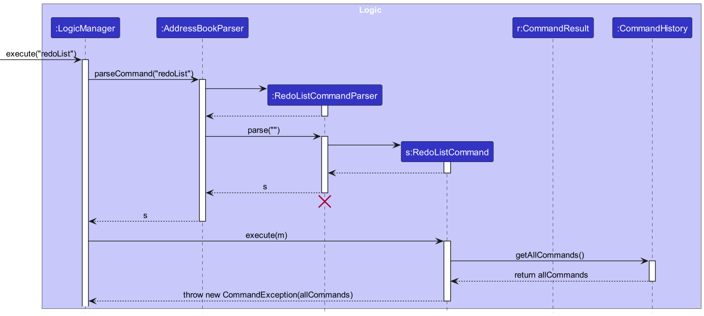

**Design Considerations:**

*   **Storage:** History is stored in-memory and is lost when the application closes. Persisting history could be a future enhancement.
*   **Re-parsing vs. Storing Command Objects:** The current approach stores command *strings* and re-parses them.
    *   *Pros:* Simpler to store, avoids potential issues with storing complex command object states.
    *   *Cons:* Relies on the parser being deterministic and available. Minor overhead of re-parsing.
    *   *Alternative:* Store executed `Command` objects directly. Requires commands to be potentially serializable or easily reconstructible, might be more complex.

--------------------------------------------------------------------------------------------------------------------

## Documentation, logging, testing, configuration, dev-ops

* [Documentation guide](Documentation.md)
* [Testing guide](Testing.md)
* [Logging guide](Logging.md)
* [Configuration guide](Configuration.md)
* [DevOps guide](DevOps.md)

--------------------------------------------------------------------------------------------------------------------

## Appendix: Requirements

### Product scope

**Target user profile**:

* early-stage startup founders
* has a need to manage a significant number of contacts, their relationships, and related events
* prefer desktop apps over other types
* can type fast
* prefers typing to mouse interactions
* is reasonably comfortable using CLI apps

**Value proposition**: Comprehensive knowledge store on potential business partners and events, optimized for speed and relationship mapping.

### User stories

Priorities: High (must have) - `* * *`, Medium (nice to have) - `* *`, Low (unlikely to have) - `*`

| Priority | As a ...        | I want to ...                       | So that I can ...                                                                               |
|----------|-----------------|-------------------------------------|-------------------------------------------------------------------------------------------------|
| `* * *`  | startup founder | add contacts                        | view contact information later                                                                  |
| `* * *`  | startup founder | list contacts                       | view contact information and their relationships                                                |
| `* * *`  | startup founder | delete contacts                     | remove contacts I no longer need                                                                |
| `* * *`  | startup founder | add relationships between contacts  | map out and visualize connections within my network                                             |
| `* * *`  | startup founder | delete relationships                | remove outdated or incorrect connections                                                        |
| `* * *`  | startup founder | search contacts by name             | find contacts by name without looking through all contacts                                      |
| `* *`    | startup founder | edit contacts                       | change contact information                                                                      |
| `* *`    | startup founder | add tags to contacts                | view contact categories later                                                                   |
| `* *`    | startup founder | delete tags from contacts           | remove tags I no longer need                                                                    |
| `* *`    | startup founder | add tags to relationships           | categorize connections (e.g., 'Investor', 'Advisor', 'Competitor')                            |
| `* *`    | startup founder | delete tags from relationships      | remove relationship tags I no longer need                                                       |
| `* *`    | startup founder | add events                          | keep track of meetings, calls, and conferences                                                  |
| `* *`    | startup founder | delete events                       | remove past or cancelled events                                                                 |
| `* *`    | startup founder | add contacts to events              | track who attended or is involved in specific events                                            |
| `* *`    | startup founder | remove contacts from events         | update event attendance or involvement                                                          |
| `* *`    | startup founder | add tags to events                  | categorize events (e.g., 'Networking', 'Funding', 'Product Launch')                           |
| `* *`    | startup founder | remove tags from events             | remove event tags I no longer need                                                              |
| `* *`    | startup founder | update event details                | change the date, location, or description of an event                                           |
| `* *`    | startup founder | search contacts by tag              | find contacts by tag without looking through all contacts                                       |
| `* *`    | startup founder | search contacts by relationship     | find contacts connected in a specific way (e.g., find all 'Advisors')                           |
| `* *`    | startup founder | search contacts by phone            | find contacts by phone without looking through all contacts                                     |
| `* *`    | startup founder | search contacts by email            | find contacts by email without looking through all contacts                                     |
| `* *`    | startup founder | search contacts by address          | find contacts by address without looking through all contacts                                   |
| `* *`    | startup founder | search contacts by social           | find contacts by social media handle without looking through all contacts                       |
| `* *`    | startup founder | sort contacts by fields             | quickly organize contacts by name, phone, or other fields                                       |
| `* *`    | startup founder | redo previous command               | re-execute the last command(s) to avoid repeating steps manually                                |
| `* *`    | startup founder | list last 10 commands               | view recent commands executed to track the workflow or find a command to redo                   |
| `* *`    | startup founder | view help message                   | access instructions on how to use the application features                                      |

### Use cases

(For all use cases below, the **System** is `INcontact` and the **Actor** is the `startup founder`, unless specified otherwise)

**Use case: UC1 - Find persons by name**

**MSS**

1. Startup founder requests to find persons by name in the address book
2. INcontact parses the request to extract the specified keywords
3. INcontact searches for persons whose names contain any of the specified keywords as a substring (case-insensitive)
4. INcontact displays the list of persons matching the search criteria with index numbers
5. Startup founder reviews the list of persons

   Use case ends.

**Extensions**

* 2a. No persons match the specified keywords.

    * 2a1. INcontact shows a message indicating no persons were found.

  Use case ends.

* 3a. The user does not specify any keywords.

    * 3a1. INcontact shows an error message indicating that keywords are required.

  Use case resumes at step 2.

---

**Use case: UC2 - Find persons by email**

**Similar to UC1 but find by email**

**MSS**

1. Startup founder requests to find persons by email in the address book
2. INcontact parses the request to extract the specified email keywords
3. INcontact searches for persons whose email contains any of the specified keywords as a substring (case-insensitive)
4. INcontact displays the list of persons matching the search criteria with index numbers
5. Startup founder reviews the list of persons

   Use case ends.

**Extensions**

* 2a. No persons match the specified email keywords.

    * 2a1. INcontact shows a message indicating no persons were found.

  Use case ends.

* 3a. The user does not specify any email keywords.

    * 3a1. INcontact shows an error message indicating that email keywords are required.

  Use case resumes at step 2.

---

**Use case: UC3 - Find persons by phone**

**Similar to UC1 but find by phone**

**MSS**

1. Startup founder requests to find persons by phone in the address book
2. INcontact parses the request to extract the specified phone number keywords
3. INcontact searches for persons whose phone number contains any of the specified keywords as a substring (case-insensitive)
4. INcontact displays the list of persons matching the search criteria with index numbers
5. Startup founder reviews the list of persons

   Use case ends.

**Extensions**

* 2a. No persons match the specified phone number keywords.

    * 2a1. INcontact shows a message indicating no persons were found.

  Use case ends.

* 3a. The user does not specify any phone number keywords.

    * 3a1. INcontact shows an error message indicating that phone number keywords are required.

  Use case resumes at step 2.

---

**Use case: UC4 - Find persons by address**

**Similar to UC1 but find by address**

**MSS**

1. Startup founder requests to find persons by address in the address book
2. INcontact parses the request to extract the specified address keywords
3. INcontact searches for persons whose address contains any of the specified keywords as a substring (case-insensitive)
4. INcontact displays the list of persons matching the search criteria with index numbers
5. Startup founder reviews the list of persons

   Use case ends.

**Extensions**

* 2a. No persons match the specified address keywords.

    * 2a1. INcontact shows a message indicating no persons were found.

  Use case ends.

* 3a. The user does not specify any address keywords.

    * 3a1. INcontact shows an error message indicating that address keywords are required.

  Use case resumes at step 2.

---

**Use case: UC5 - Find persons by relationship**

**Similar to UC1 but find by relationship**

**MSS**

1. Startup founder requests to find persons by relationship in the address book
2. INcontact parses the request to extract the specified relationship keywords
3. INcontact searches for persons whose relationship contains any of the specified keywords as a substring (case-insensitive)
4. INcontact displays the list of persons matching the search criteria with index numbers
5. Startup founder reviews the list of persons

   Use case ends.

**Extensions**

* 2a. No persons match the specified relationship keywords.

    * 2a1. INcontact shows a message indicating no persons were found.

  Use case ends.

* 3a. The user does not specify any relationship keywords.

    * 3a1. INcontact shows an error message indicating that relationship keywords are required.

  Use case resumes at step 2.

---

**Use case: UC6 - Find persons by social**

**Similar to UC1 but find by social**

**MSS**

1. Startup founder requests to find persons by social media information in the address book
2. INcontact parses the request to extract the specified social media keywords
3. INcontact searches for persons whose social media information contains any of the specified keywords as a substring (case-insensitive)
4. INcontact displays the list of persons matching the search criteria with index numbers
5. Startup founder reviews the list of persons

   Use case ends.

**Extensions**

* 2a. No persons match the specified social media keywords.

    * 2a1. INcontact shows a message indicating no persons were found.

  Use case ends.

* 3a. The user does not specify any social media keywords.

    * 3a1. INcontact shows an error message indicating that social media keywords are required.

  Use case resumes at step 2.

---

**Use case: UC7 - Find persons by tag**

**Similar to UC1 but find by tag**

**MSS**

1. Startup founder requests to find persons by tag in the address book
2. INcontact parses the request to extract the specified tag keywords
3. INcontact searches for persons whose tags contain any of the specified keywords as a substring (case-insensitive)
4. INcontact displays the list of persons matching the search criteria with index numbers
5. Startup founder reviews the list of persons

   Use case ends.

**Extensions**

* 2a. No persons match the specified tag keywords.

    * 2a1. INcontact shows a message indicating no persons were found.

  Use case ends.

* 3a. The user does not specify any tag keywords.

    * 3a1. INcontact shows an error message indicating that tag keywords are required.

  Use case resumes at step 2.

---

**Use case: UC8 - Sort persons by specified fields**

**MSS**

1. Startup founder requests to sort persons in the address book
2. INcontact parses the request to extract the sorting fields and reverse flag (if specified)
3. INcontact validates the specified fields to ensure they are valid (name, phone, email, address, tags, socials)
4. INcontact sorts the address book based on the specified fields
5. INcontact displays the sorted list of persons with index numbers
6. Startup founder reviews the sorted list of persons

   Use case ends.

**Extensions**

* 2a. The user does not specify any sorting fields.

    * 2a1. INcontact shows an error message indicating that sorting fields are required.

  Use case ends.

* 3a. An invalid field is specified.

    * 3a1. INcontact shows an error message indicating the invalid field.

  Use case ends.

* 4a. The reverse flag is specified but no fields are provided.

    * 4a1. INcontact shows an error message indicating that sorting fields are required along with the reverse flag.

  Use case ends.

* 5a. The user requests sorting by multiple fields.

    * 5a1. INcontact sorts the address book first by the primary field, then by subsequent fields.

  Use case resumes at step 4.
---
**Use case: UC9 - Redo a previously executed command**

**MSS**

1. Startup founder requests to redo a previously executed command by specifying its index in the command history
2. INcontact parses the request to extract the command index
3. INcontact validates that the command index is within the valid range (1 to 10)
4. INcontact retrieves the specified command from the command history
5. INcontact re-executes the specified command
6. INcontact displays the result of the re-executed command

   Use case ends.

**Extensions**

* 2a. The user does not specify a valid command index.

    * 2a1. INcontact shows an error message indicating that the command index must be between 1 and 10.

  Use case ends.

* 3a. The command index is out of the valid range (less than 1 or greater than 10).

    * 3a1. INcontact shows an error message indicating that the command index is invalid.

  Use case ends.

* 4a. The command index does not exist in the history (not enough command history).

    * 4a1. INcontact shows an error message indicating that there are not enough commands in history to redo.

  Use case ends.

* 5a. An error occurs while re-executing the command.

    * 5a1. INcontact shows an error message indicating that there was an issue re-executing the command.

  Use case ends.
---
**Use case: UC10 - List the last 10 commands in the command history**

**MSS**

1. Startup founder requests to list the last 10 commands from the command history
2. INcontact parses the request and recognizes the `redoList` command
3. INcontact retrieves the last 10 commands from the command history
4. INcontact displays the list of the last 10 commands, showing each with an index number
5. Startup founder reviews the list of commands

   Use case ends.

**Extensions**

* 2a. No commands exist in the history.

    * 2a1. INcontact shows an error message indicating that no command history exists.

  Use case ends.

* 3a. An error occurs while retrieving the commands from the history.

    * 3a1. INcontact shows an error message indicating that there was an issue retrieving the command history.

  Use case ends.
---

**Use Case: UC-AddRel - Add a Relationship**

**MSS**
1. Startup founder requests to add a relationship between two existing contacts using their IDs and specifying the forward and reverse relationship names.
1. INcontact parses the command, identifying the two user IDs, the forward name, the reverse name, and any tags.
1. INcontact verifies that both user IDs correspond to existing persons in the address book.
1. INcontact verifies that a relationship with the same users and names does not already exist.
1. INcontact creates the `Relationship` object.
1. INcontact adds the relationship to the address book.
1. INcontact displays a success message confirming the relationship creation, showing the names of the involved persons.
    Use case ends.

**Extensions**
*   3a. One or both user IDs do not exist.
    *   3a1. INcontact shows an error message "One or both contacts do not exist."
        Use case ends.
*   4a. The relationship (or its reverse equivalent) already exists.
    *   4a1. INcontact shows an error message "Relationship already exists."
        Use case ends.
*   1a. User attempts to add a relationship between a person and themselves (same ID provided twice).
    *   1a1. INcontact shows an error message "A contact cannot have a relationship with itself."
        Use case ends.
*   1b. User provides an empty relationship name.
    *   2b1. INcontact shows an error message "Relationship name cannot be empty."
        Use case ends.

---
**Use Case: UC-DelRel - Delete a Relationship**

**MSS**
1. Startup founder requests to delete a relationship using the IDs of the two involved persons and one of the relationship names (either forward or reverse).
1. INcontact parses the command to identify the two user IDs and the relationship name.
1. INcontact verifies that both user IDs correspond to existing persons.
1. INcontact finds the relationship matching the two user IDs and the provided name (checking against both forward and reverse names).
1. INcontact removes the relationship from the address book.
1. INcontact displays a success message confirming the deletion, showing the names of the involved persons.
    Use case ends.

**Extensions**
*   3a. One or both user IDs do not exist.
    *   3a1. INcontact shows an error message "One or both persons could not be found."
        Use case ends.
*   4a. No relationship matching the criteria is found.
    *   4a1. INcontact shows an error message "No relationship found with the specified details."
        Use case ends.
*   1a. User provides empty User IDs or relationship name.
    *   2a1. INcontact shows an error message "User IDs and relationship name cannot be empty."
        Use case ends.

---
**Use Case: UC-AddRelTag - Add Tag to Relationship**

**MSS**
1. Startup founder requests to add a tag to an existing relationship, identifying the relationship by the two user IDs and one of the relationship names, and specifying the tag to add.
1. INcontact parses the command.
1. INcontact finds the specified relationship.
1. INcontact verifies the tag does not already exist on the relationship.
1. INcontact creates an updated `Relationship` object with the new tag added.
1. INcontact replaces the old relationship with the updated one in the address book.
1. INcontact displays a success message showing the updated relationship.
    Use case ends.

**Extensions**
*   3a. The specified relationship is not found.
    *   3a1. INcontact shows an error message "The specified relationship was not found."
        Use case ends.
*   4a. The tag already exists on the relationship.
    *   4a1. INcontact shows an error message "This tag already exists in the relationship."
        Use case ends.

---
**Use Case: UC-DelRelTag - Delete Tag from Relationship**

**MSS**
1. Startup founder requests to delete a tag from an existing relationship, identifying the relationship by the two user IDs and one of the relationship names, and specifying the tag to delete.
1. INcontact parses the command.
1. INcontact finds the specified relationship. 
1. INcontact verifies the tag exists on the relationship.
1. INcontact creates an updated `Relationship` object with the tag removed.
1. INcontact replaces the old relationship with the updated one in the address book.
1. INcontact displays a success message showing the updated relationship.
    Use case ends.

**Extensions**
*   3a. The specified relationship is not found.
    *   3a1. INcontact shows an error message "The specified relationship was not found."
        Use case ends.
*   4a. The tag does not exist on the relationship.
    *   4a1. INcontact shows an error message "This tag does not exist in the relationship."
        Use case ends.

---
**Use Case: UC-AddEvent - Add an Event**

**MSS**
1. Startup founder requests to add an event, providing name, date, and optionally location, description, tags, and contact names.
1. INcontact parses the command, including parsing the date using natural language processing.
1. INcontact validates the required fields (name, date).
1. INcontact creates the `Event` object (initially with an empty contact list).
1. INcontact verifies the event does not already exist (based on unique ID or other criteria if defined).
1. INcontact adds the event to the address book.
1. For each contact name provided:
   1. INcontact checks if a person with that name exists in the address book.
   1. If the person does not exist, INcontact adds a new person with that name and default details.
   1. INcontact adds the corresponding `Person` object to the event's contact list.
1. INcontact displays a success message confirming the event addition.
    Use case ends.

**Extensions**
*   3a. Required fields are missing or invalid (e.g., unparseable date).
    *   3a1. INcontact shows an error message detailing the issue.
        Use case ends.
*   5a. An identical event already exists.
    *   5a1. INcontact shows an error message "This event already exists in the address book."
        Use case ends.

---
**Use Case: UC-DelEvent - Delete an Event**

**MSS**
1. Startup founder requests to delete an event using its unique ID.
1. INcontact parses the command to get the event ID.
1. INcontact finds the event corresponding to the ID.
1. INcontact removes the event from the address book.
1. INcontact displays a success message.
    Use case ends.

**Extensions**
*   3a. No event with the specified ID is found.
    *   3a1. INcontact shows an error message "Event not found."
        Use case ends.

---
**Use Case: UC-AddEventContact - Add Contact to Event**

**MSS**
1. Startup founder requests to add a contact to an event, specifying the event by index and the contact by name.
1. INcontact parses the command.
1. INcontact retrieves the event at the specified index.
1. INcontact finds or creates the `Person` object corresponding to the contact name (similar to UC-AddEvent step 7).
1. INcontact verifies the contact is not already associated with the event.
1. INcontact adds the `Person` object to the event's contact list. (Note: May require `Model.updateEvent` if `Event`'s contact list isn't directly mutable or observed).
1. INcontact displays a success message.
    Use case ends.

**Extensions**
*   3a. Invalid event index provided.
    *   3a1. INcontact shows an error message "The event index provided is invalid."
        Use case ends.
*   5a. Contact already exists in the event.
    *   5a1. INcontact shows an error message "This contact already exists in the event."
        Use case ends.

---
**Use Case: UC-DelEventContact - Delete Contact from Event**

**MSS**
1. Startup founder requests to remove a contact from an event, specifying the event by index and the contact by name.
1. INcontact parses the command.
1. INcontact retrieves the event at the specified index.
1. INcontact finds the `Person` object corresponding to the contact name within the event's contact list.
1. INcontact removes the `Person` object from the event's contact list. (Note: May require `Model.updateEvent`).
1. INcontact displays a success message.
    Use case ends.

**Extensions**
*   3a. Invalid event index provided.
    *   3a1. INcontact shows an error message "The event index provided is invalid."
        Use case ends.
*   4a. Contact is not found within the event's contact list.
    *   4a1. INcontact shows an error message "This contact does not exist in the event."
        Use case ends.

---
*(Use cases for adding/deleting event tags and updating event properties follow a similar pattern to relationship tag management and event contact management, involving parsing, finding the event, performing the modification, and updating the model.)*

---

### Non-Functional Requirements

1. Should work on any _mainstream OS_ as long as it has the exact version of Java `17` installed according to the [Java Installation Guides](https://se-education.org/guides/tutorials/javaInstallation.html).
1. Should be able to hold up to 1000 contacts, 1000 relationships, and 500 events without a noticeable sluggishness in performance for typical usage.
1. A user with above average typing speed for regular English text should be able to accomplish most of the tasks faster using commands than using the mouse.
1. Data should be persisted between application sessions.

### Glossary

*   **Mainstream OS**: Windows, Linux, macOS
*   **Relationship**: A directed connection between two contacts, having a forward name, a reverse name, and optional tags.
*   **Event**: A scheduled item with a name, date/time, optional location/description, tags, and associated contacts.
*   **ID**: A unique identifier automatically generated for each Person and Event. Used internally, but also shown to the user (e.g., for relationship commands).

--------------------------------------------------------------------------------------------------------------------

## Appendix: Instructions for manual testing

Given below are instructions to test the app manually.

:information_source: **Note:** These instructions only provide a starting point for testers to work on;
testers are expected to do more *exploratory* testing.

### Launch and shutdown

1. Initial launch 
   1. Download the jar file and copy into an empty folder. 
   1. Double-click the jar file. Expected: Shows the GUI with a set of sample contacts. Relationships (if any sample data added) and Events (if any sample data added) might be displayed or accessible. The window size may not be optimum. Check for `config.json`, `preferences.json` and `data/addressbook.json` files created.
1. Saving window preferences
   1. Resize the window to an optimum size. Move the window to a different location. Close the window.
   1. Re-launch the app by double-clicking the jar file.
        Expected: The most recent window size and location is retained.

### Adding Relationships

1.  Add a valid relationship
    1.  Prerequisites: Have at least two contacts in the list. Note their IDs (shown in the contact card). Let IDs be `ID1` and `ID2`.
    1. Test case: `addRelationship u/ID1 u/ID2 fn/Mentor rn/Mentee t/Work`
        Expected: Success message is shown. The contact cards for persons with `ID1` and `ID2` should now display the relationship ("Mentor MenteeName" on ID1's card, "Mentee MentorName" on ID2's card) and the "Work" tag under the relationship.
1. Add a duplicate relationship
   1. Prerequisites: Relationship added in the previous step exists.
   1. Test case: `addRelationship u/ID1 u/ID2 fn/Mentor rn/Mentee`
        Expected: Error message "Relationship already exists." is shown. No changes in the UI.
   1. Test case: `addRelationship u/ID2 u/ID1 fn/Mentee rn/Mentor` (reversed roles)
        Expected: Error message "Relationship already exists." is shown. No changes in the UI.
1. Add relationship with non-existent ID
   1. Prerequisites: Get a valid ID `ID1`.
   1. Test case: `addRelationship u/ID1 u/NonExistentID fn/Friend rn/Friend`
        Expected: Error message "One or both contacts do not exist."
4.  Add relationship with self
    1.  Prerequisites: Get a valid ID `ID1`.
    2.  Test case: `addRelationship u/ID1 u/ID1 fn/Self rn/Self`
        Expected: Error message "A contact cannot have a relationship with itself."
5.  Add relationship with missing/empty names
    1.  Test case: `addRelationship u/ID1 u/ID2 fn/ rn/Mentee`
        Expected: Error message "Relationship name cannot be empty." or similar constraint violation.
    2.  Test case: `addRelationship u/ID1 u/ID2 fn/Mentor rn/`
        Expected: Error message "Relationship name cannot be empty." or similar constraint violation.

### Deleting Relationships

1.  Delete an existing relationship
    1.  Prerequisites: Add a relationship `addRelationship u/ID1 u/ID2 fn/Boss rn/Employee`.
    2.  Test case: `deleteRelationship u/ID1 u/ID2 n/Boss`
        Expected: Success message shown. Relationship disappears from the contact cards of persons `ID1` and `ID2`.
    3.  Prerequisites: Add the relationship again `addRelationship u/ID1 u/ID2 fn/Boss rn/Employee`.
    4.  Test case: `deleteRelationship u/ID1 u/ID2 n/Employee` (using reverse name)
        Expected: Success message shown. Relationship disappears from the contact cards.
2.  Delete non-existent relationship
    1.  Prerequisites: No relationship named "Friend" exists between `ID1` and `ID2`.
    2.  Test case: `deleteRelationship u/ID1 u/ID2 n/Friend`
        Expected: Error message "No relationship found..."
3.  Delete with non-existent ID
    1.  Prerequisites: `NonExistentID` is not a valid person ID.
    2.  Test case: `deleteRelationship u/ID1 u/NonExistentID n/Boss`
        Expected: Error message "One or both persons could not be found."

### Managing Relationship Tags

1.  Add a tag to a relationship
    1.  Prerequisites: Add relationship `addRelationship u/ID1 u/ID2 fn/Partner rn/Partner`.
    2.  Test case: `addRelationshipTag u/ID1 u/ID2 n/Partner t/ProjectX`
        Expected: Success message. The "ProjectX" tag appears under the "Partner" relationship on the relevant contact cards.
    3.  Test case: `addRelationshipTag u/ID1 u/ID2 n/Partner t/ProjectX` (duplicate tag)
        Expected: Error message "This tag already exists..."
2.  Delete a tag from a relationship
    1.  Prerequisites: Relationship with tag "ProjectX" exists from previous step.
    2.  Test case: `deleteRelationshipTag u/ID1 u/ID2 n/Partner t/ProjectX`
        Expected: Success message. The "ProjectX" tag disappears from the relationship display.
    3.  Test case: `deleteRelationshipTag u/ID1 u/ID2 n/Partner t/NonExistentTag`
        Expected: Error message "This tag does not exist..."

### Adding Events

1. Add a valid event
   1. Test case: `addEvent en/Team Meeting d/tomorrow 2pm l/Office desc/Weekly sync t/Work`
        Expected: Success message shown. (Event list panel should update if implemented).
   1. Test case: `addEvent en/Conference d/2025-10-20 09:00 c/Alex Yeoh c/Bernice Yu` (Assuming Alex and Bernice exist)
        Expected: Success message. Contacts Alex Yeoh and Bernice Yu should be associated with the event internally.
   1. Test case: `addEvent en/New Client Pitch d/next monday c/David Li c/NewContactName` (Assuming David Li exists, NewContactName does not)
        Expected: Success message. A new contact "NewContactName" with default details should be added to the main contact list. Both David Li and NewContactName should be associated with the event.
2.  Add event with missing required fields
    1.  Test case: `addEvent d/today`
        Expected: Error message indicating event name (`en/`) is missing.
    2.  Test case: `addEvent en/Party l/Home`
        Expected: Error message indicating date (`d/`) is missing.
3.  Add event with invalid date
    1.  Test case: `addEvent en/Invalid Date Event d/invalid-date-format`
        Expected: Error message indicating the date could not be parsed.

### Deleting Events

1.  Delete an existing event
    1.  Prerequisites: Add an event, e.g., `addEvent en/ToDelete d/today`. Note its generated ID (requires viewing storage or a future `listEvents` command). Let the ID be `EventID1`.
    2.  Test case: `deleteEvent u/EventID1`
        Expected: Success message. Event is removed.
2.  Delete non-existent event
    1.  Test case: `deleteEvent u/NonExistentEventID`
        Expected: Error message "Event not found."

### Managing Event Contacts & Tags

1.  Add/Delete contact to/from event
    1.  Prerequisites: Add an event `addEvent en/TestEvent d/today`. Assume its index is 1. Add a person `add n/TestPerson`.
    2.  Test case: `addEventContact 1 c/TestPerson`
        Expected: Success message. "TestPerson" is associated with "TestEvent".
    3.  Test case: `addEventContact 1 c/TestPerson` (duplicate)
        Expected: Error message "This contact already exists...".
    4.  Test case: `deleteEventContact 1 c/TestPerson`
        Expected: Success message. "TestPerson" is removed from "TestEvent".
    5.  Test case: `deleteEventContact 1 c/NonExistentContactInEvent`
        Expected: Error message "This contact does not exist...".
2.  Add/Delete tag to/from event
    1.  Prerequisites: Event at index 1 exists.
    2.  Test case: `addEventTag 1 t/Urgent`
        Expected: Success message. Tag "Urgent" added to event.
    3.  Test case: `deleteEventTag 1 t/Urgent`
        Expected: Success message. Tag "Urgent" removed.

### Updating Event Properties

1.  Update date, location, description
    1.  Prerequisites: Event at index 1 exists.
    2.  Test case: `updateEventDate 1 d/2024-12-25T10:00`
        Expected: Success message, event date updated.
    3.  Test case: `updateEventLoc 1 l/Virtual Meeting Room`
        Expected: Success message, event location updated.
    4.  Test case: `updateEventDesc 1 desc/Final project discussion`
        Expected: Success message, event description updated.
    5.  Test case with invalid index or missing prefix: `updateEventDate 99 d/2024-01-01T00:00`, `updateEventLoc 1 New Location`
        Expected: Appropriate error messages.

### Find Commands (Substring Matching)

1.  Find by name substring
    1.  Prerequisites: Sample contacts loaded (includes "Alex Yeoh", "Bernice Yu").
    2.  Test case: `findName Alex`
        Expected: "Alex Yeoh" is listed.
    3.  Test case: `findName Yeo`
        Expected: "Alex Yeoh" is listed.
    4.  Test case: `findName ice`
        Expected: "Bernice Yu" is listed.
    5.  Test case: `findName xyz`
        Expected: Status message indicates 0 persons listed.
2.  Find by relationship keyword (using `findRelationship`)
    1.  Prerequisites: Add relationships: `addRelationship u/ID1 u/ID2 fn/Business Partner rn/Business Partner t/Tech`, `addRelationship u/ID1 u/ID3 fn/Investor rn/Investee t/Finance`.
    2.  Test case: `findRelationship Partner`
        Expected: Persons with ID1 and ID2 are listed.
    3.  Test case: `findRelationship Invest`
        Expected: Persons with ID1 and ID3 are listed.
    4.  Test case: `findRelationship Tech` (finding by relationship tag - *verify if this is supported by the predicate*)
        Expected: *If supported:* Persons ID1 and ID2 listed. *If not supported:* 0 persons listed or only matches relationship name. **(Note: The current `RelationshipContainsKeywordsAsSubstringPredicate` only checks if the person is *involved* in *any* relationship when the command is run, not if the relationship *itself* matches the keyword. This needs correction in the predicate or command logic to be useful.)**

### Sort Command

1.  Sort by single field
    1.  Prerequisites: List persons.
    2.  Test case: `sort name`
        Expected: Persons list is sorted alphabetically by name.
    3.  Test case: `sort -r phone`
        Expected: Persons list is sorted by phone number in descending order.
2.  Sort by multiple fields
    1.  Prerequisites: Add persons with the same name but different phone numbers.
    2.  Test case: `sort name phone`
        Expected: Persons list is sorted by name, and those with the same name are further sorted by phone number.
3.  Invalid sort field
    1.  Test case: `sort invalidField`
        Expected: Error message "Invalid field: invalidField".

### Redo and Redo List Commands

1.  List command history
    1.  Prerequisites: Execute several valid commands (e.g., `list`, `add n/Test`, `delete 1`).
    2.  Test case: `redoList`
        Expected: A numbered list of the recently executed commands (up to 10) is displayed in the result area (possibly as an error message, based on current implementation). `redo` commands themselves should not appear.
    **Note: redoList only keeps track of the command history of the last 10 commands, and this history will be cleared when the program is terminated.**
2.  Redo a command
    1.  Prerequisites: Execute `add n/RedoTestPerson`. Then execute `list`. The `add` command should be at index 2 in `redoList`.
    2.  Test case: `redo 2`
        Expected: The `add n/RedoTestPerson` command is executed again. An error "This person already exists..." should appear because the person was already added.
    3.  Test case: `delete 1`. Then `redo 1`.
        Expected: The `delete 1` command is executed again. If index 1 exists, it's deleted. If not, an "invalid index" error occurs for the *re-executed* delete.
3.  Invalid redo index
    1.  Test case: `redo 0`
        Expected: Error message "Invalid command index..."
    2.  Test case: `redo 11`
        Expected: Error message "Invalid command index..."
    3.  Test case: `redo 5` (when only 3 commands are in history)
        Expected: Error message "Not enough commands in history..."

### Saving data

1.  Dealing with missing/corrupted data files
    1.  Simulate missing file: Close the app. Delete the `data/addressbook.json` file. Relaunch the app.
        Expected: App starts with sample data (or an empty state if sample data loading is disabled after first run). A message indicating a new file is created might be logged.
    2.  Simulate corrupted file: Close the app. Open `data/addressbook.json` and replace its content with invalid JSON (e.g., "abcde"). Save the file. Relaunch the app.
        Expected: App starts with sample data or empty state. A warning about the corrupted file being loaded and replaced should appear in the logs or possibly as an error dialog.
2.  Verify data persistence
    1.  Add a person, a relationship, and an event.
    2.  Close the application.
    3.  Relaunch the application.
        Expected: The added person, relationship, and event are still present and correctly loaded. Check relationship display on person cards.
