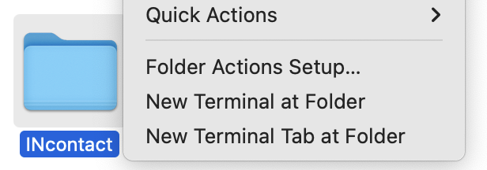

INcontact is a **desktop app for managing business contacts, optimized for use via a Command Line Interface** (CLI) while still having the benefits of a Graphical User Interface (GUI). If you can type fast, INcontact can get your contact management tasks done faster than traditional GUI apps.

* Table of Contents
{:toc}

--------------------------------------------------------------------------------------------------------------------

## Quick start

1. Ensure that you have Java 17 or above installed. If Java is not installed or the `java` command is not available in the command line, follow the [Java installation guide](https://se-education.org/guides/tutorials/javaInstallation.html). 
   **Mac users:** Ensure you have installed the precise Java version prescribed in the [Java installation guide for Mac](https://se-education.org/guides/tutorials/javaInstallationMac.html).

1. Download the [latest `INcontact.jar` file](https://github.com/AY2425S2-CS2103T-T09-1/tp/releases/latest/download/INcontact.jar).

1. Move `INcontact.jar` to the folder you want to use as the _home folder_ for INcontact.

   

   **:information_source: The _home folder_ contains `INcontact.jar` and user data.**

   

1. Open the _home folder_ in a command terminal and run INcontact with `java -jar INcontact.jar`.

   

   **:information_source: Opening a folder in a terminal**

   Right-click the folder and select `open in terminal` or `new terminal at folder`.

   

   If this is not available, you can use the `cd` (change directory) command. Open a terminal, type `cd` followed by a space, then drag the _home folder_ into the terminal. The path to the _home folder_ should appear, and you can press enter.

   If this does not work, you can specify the path manually, e.g. `cd /Users/johndoe/INcontact`

   

1. A window similar to the below should appear in a few seconds. Note how the app contains some sample data. 
   

1. Type the command in the command box and press Enter to execute it. e.g. typing **`help`** and pressing Enter will open the help window. 
   Some example commands you can try:

   * `list` : Lists all contacts.

   * `add n/John Doe p/98765432 e/johnd@example.com a/John street, block 123, #01-01` : Adds a contact named `John Doe` to the Address Book.

   * `delete 3` : Deletes the 3rd contact shown in the current list.

   * `clear` : Deletes all contacts.

   * `exit` : Exits the app.

1. Refer to the [Features](#features) below for details of each command.

--------------------------------------------------------------------------------------------------------------------

## Features

**:information_source: Notes about the command format:** 

* Words in `UPPER_CASE` are the parameters to be supplied by the user. 
  e.g. in `add n/NAME`, `NAME` is a parameter which can be used as `add n/John Doe`.

* Items in square brackets are optional. 
  e.g `n/NAME [t/TAG]` can be used as `n/John Doe t/friend` or as `n/John Doe`.

* Items with `…`​ after them can be used multiple times including zero times. 
  e.g. `[t/TAG]…​` can be used as ` ` (i.e. 0 times), `t/friend`, `t/friend t/family` etc.

* Parameters can be in any order. 
  e.g. if the command specifies `n/NAME p/PHONE_NUMBER`, `p/PHONE_NUMBER n/NAME` is also acceptable.

* Extraneous parameters for commands that do not take in parameters (such as `help`, `list`, `exit` and `clear`) will be ignored. 
  e.g. if the command specifies `help 123`, it will be interpreted as `help`.

* If you are using a PDF version of this document, be careful when copying and pasting commands that span multiple lines as space characters surrounding line-breaks may be omitted when copied over to the application.

---
### Viewing help : `help`

Shows a message explaning how to access the help page.

Format: `help`

---
### Adding a person: `add`

Adds a person to INcontact.

Format: `add n/NAME [p/PHONE_NUMBER] [e/EMAIL] [a/ADDRESS] [s/SOCIAL]... [t/TAG]...`

:bulb: **Tip:**
A person can have any number of tags (including 0)

Examples:
* `add n/John Doe p/98765432 e/johnd@example.com a/John street, block 123, #01-01 s/@social1 s/social2 t/Investor`
* `add n/Betsy Crowe t/friend e/betsycrowe@example.com a/Newgate Prison p/1234567 t/criminal`
* `add n/Caroly Wilcox` Adds a contact with name only

---
### Listing all persons : `list`

Shows a list of all persons in INcontact.

Format: `list`

---
### Editing a person : `edit`

Edits an existing person in INcontact.

Format: `edit INDEX [n/NAME] [p/PHONE_NUMBER] [e/EMAIL] [a/ADDRESS] [s/SOCIAL]... [t/TAG]...`

* Edits the person at the specified `INDEX`. The index refers to the index number shown in the displayed person list. The index **must be a positive integer** 1, 2, 3, …​
* At least one of the optional fields must be provided.
* Existing values will be updated to the input values.
* When editing tags, the existing tags of the person will be removed i.e adding of tags is not cumulative.
* You can remove all the person’s tags by typing `t/` without
    specifying any tags after it.

Examples:
*  `edit 1 p/91234567 e/johndoe@example.com` Edits the phone number and email address of the 1st person to be `91234567` and `johndoe@example.com` respectively.
*  `edit 2 n/Betsy Crower t/` Edits the name of the 2nd person to be `Betsy Crower` and clears all existing tags.
*  `edit 1 p/91234567 s/@john`
*  `edit 1 s/@elmo` Edits the socials of the 1st person to be `@elmo`.

---
### Deleting a person : `delete`

Deletes the specified person from INcontact.

Format: `delete INDEX`

* Deletes the person at the specified `INDEX`.
* The index refers to the index number shown in the displayed person list.
* The index **must be a positive integer** 1, 2, 3, …​

Examples:
* `list` followed by `delete 2` deletes the 2nd person in INcontact.
* `find Betsy` followed by `delete 1` deletes the 1st person in the results of the `find` command.

---
### Clearing all entries : `clear`

Clears all entries from INcontact.

Format: `clear`

---
### Adding a relationship: `addRelationship`

Adds a relationship to INcontact.

Format: `addRelationship u/USER_ID_1 u/USER_ID_2 fn/FORWARD_NAME rn/REVERSE_NAME [t/TAG]...`

Example:
* `addRelationship u/12345678 u/87654321 fn/Boss of rn/Reports to t/Work`

---
### Deleting a relationship: `deleteRelationship`

Deletes a relationship from INcontact.

Format: `deleteRelationship u/USER_ID_1 u/USER_ID_2 n/FORWARD_NAME_OR_REVERSE_NAME`

Example:
* `deleteRelationship u/12345678 u/87654321 n/Business Partner`

---
### Adding a relationship tag: `addRelationshipTag`

Adds a relationship tag to a relationship.

Format: `addRelationshipTag u/USER_ID_1 u/USER_ID_2 n/FORWARD_NAME_OR_REVERSE_NAME t/TAG`

Example:
* `addRelationshipTag u/12345678 u/87654321 n/Business Partner t/Important`

---
### Deleting a relationship tag: `deleteRelationshipTag`

Deletes a relationship tag from a relationship.

Format: `deleteRelationshipTag u/USER_ID_1 u/USER_ID_2 n/FORWARD_NAME_OR_REVERSE_NAME t/TAG`

Example:
* `deleteRelationshipTag u/12345678 u/87654321 n/Business Partner t/Important`

---
### Adding an event: `addEvent`

Adds an event to INcontact.

Format: `addEvent en/EVENT_NAME d/DATE [l/LOCATION] [desc/DESCRIPTION] [t/TAG]... [c/CONTACT_NAME]...`

Examples:
* `addEvent en/Annual Investor Meetup d/2025-03-15 l/Singapore desc/Networking session for investors t/Finance c/John Doe c/Jane Smith`
* `addEvent en/Tech Conference d/2025-06-02`

---
### Deleting an event: `deleteEvent`

Deletes an event from INcontact.

Format: `deleteEvent u/EVENT_ID`

Example:
* `deleteEvent u/98765432`

---
### Updating an event description: `updateEventDesc`

Updates the description of an event.

Format: `updateEventDesc INDEX desc/NEW_DESCRIPTION`

Example:
* `updateEventDesc 1 desc/New description for the event`

---
### Updating an event time: `updateEventDate`

Updates the date of an event.

**Format:**  
`updateEventDate INDEX d/NEW_DATE`

**Example:**
* `updateEventDate 1 d/2025-03-15T09:30`

---
### Updating an event location: `updateEventLoc`

Updates the location of an event.

**Format:**  
`updateEventLoc INDEX l/NEW_LOCATION`

**Example:**
* `updateEventLoc 1 l/Conference Room`

---
### Adding an event tag: `addEventTag`

Adds a tag to an event.

Format: `addEventTag INDEX t/TAG_NAME`

Example:
* `addEventTag 1 t/Finance`

---
### Deleting an event tag: `deleteEventTag`

Deletes a tag from an event.

Format: `deleteEventTag INDEX t/TAG_NAME`

Example:
* `deleteEventTag 1 t/Finance`

---
### Adding an event contact: `addEventContact`

Adds a contact to an event.

Format: `addEventContact INDEX c/CONTACT_NAME`

Example:
* `addEventContact 1 c/John Doe`

---
### Deleting an event contact: `deleteEventContact`

Deletes a contact from an event.

Format: `deleteEventContact INDEX c/CONTACT_NAME`

Example:
* `deleteEventContact 1 c/John Doe`

---
### Exiting the program : `exit`

Exits the program.

Format: `exit`

### Saving the data

AddressBook data are saved in the hard disk automatically after any command that changes the data. There is no need to save manually.

### Editing the data file

AddressBook data are saved automatically as a JSON file `[JAR file location]/data/addressbook.json`. Advanced users are welcome to update data directly by editing that data file.

:exclamation: **Caution:**
If your changes to the data file makes its format invalid, INcontact will discard all data and start with an empty data file at the next run. Hence, it is recommended to take a backup of the file before editing it. 
Furthermore, certain edits can cause the INcontact to behave in unexpected ways (e.g., if a value entered is outside of the acceptable range). Therefore, edit the data file only if you are confident that you can update it correctly.

---
### Locating persons by name: `findName`
Finds persons whose names contain any of the given keywords as a substring.  
Format: `findName KEYWORD [MORE_KEYWORDS]`
* The search is case-insensitive. e.g., `hans` will match `Hans`
* Only the name field is searched.
* Persons matching at least one keyword will be returned (i.e., `OR` search). e.g., `Han Ya` will return `Hans Gruber`, `Bo Yang`

Examples:
* `findName Joh` returns `john` and `John Doe`
* `findName ale david` returns `Alex Yeoh`, `David Li` 
  

---
### Locating persons by phone: `findPhone`
Finds persons whose phone numbers contain any of the given keywords as a substring.  
Format: `findPhone KEYWORD [MORE_KEYWORDS]`
* Only the phone number field is searched.

Examples:
* `findPhone 123 456`

---
### Locating persons by email: `findEmail`
Finds persons whose emails contain any of the given keywords as a substring.  
Format: `findEmail KEYWORD [MORE_KEYWORDS]`
* Only the email field is searched.

Examples:
* `findEmail example1@example.com`

---
### Locating persons by address: `findAddress`
Finds persons whose addresses contain any of the given keywords as a substring.  
Format: `findAddress KEYWORD [MORE_KEYWORDS]`
* Only the address field is searched.

Examples:
* `findAddress street avenue park`

---
### Locating persons by social: `findSocial`
Finds persons whose social media handles contain any of the given keywords as a substring.  
Format: `findSocial KEYWORD [MORE_KEYWORDS]`
* Only the social media handle field is searched.

Examples:
* `findSocial facebook twitter linkedin`
---
### Locating persons by relationship: `findRelationship`

Finds persons involved in relationships where their role in any relationship contains any of the given keywords as a substring.

**Format**: `findRelationship KEYWORD [MORE_KEYWORDS]`

* Only the role names in relationships are searched.
* The search is case-insensitive.
* **Important**: The command returns **only the person whose role** in the relationship contains the search keyword.
* For example, if Person A has a relationship "Boss" with Person B whose relationship is "Employee", searching for `findRelationship Boss` will return only Person A, because their role contains the keyword "Boss".

**Examples**:
* `findRelationship family friend` returns all persons where their role in any relationship containing "family" or "friend" as substrings.
---
### Locating persons by tag: `findTag`
Finds persons whose tags contain any of the given keywords as a substring.  
Format: `findTag KEYWORD [MORE_KEYWORDS]`
* Only the tags field is searched.
* The search is case-insensitive.

Examples:
* `findTag colleague important`
---
### Important Note on Character Encoding for Find Commands

**Note:** All find commands (`findName`, `findPhone`, etc.) work best with standard English alphabet characters. When using special characters or non-English alphabets (such as Turkish, Chinese, etc.), search results may be unexpected.

**Example:** Searching for names with special characters might return more or fewer results than expected.

**Recommendation:** For best results, use standard English characters in your your contact information.

---
### Sorting the Address Book: `sort`
Sorts the address book by one or more fields.

**Format**: `sort [-r] FIELD [MORE_FIELDS]`

* The `-r` flag reverses the sorting order.
* You can sort by multiple fields (e.g., name, phone, email, address, tags).
* Only the specified fields will be considered in the sort.
* Sorting is performed lexicographically by the first field first, then by the second field for entries with identical first field values, and so on.

**Examples**:
* `sort -r name phone` sorts the address book by name and phone in reverse order.
* `sort email` sorts the address book by email.
---

### Important Note on Character Encoding for Sort Commands

**Note:** The sort functionality works best with standard English alphabet characters. When sorting entries containing special characters or non-English alphabets, the sorting order may not follow expected language-specific rules.

**Recommendation:** For predictable sorting results, use standard English characters in your contact information.

---
### Re-executing Commands: `redo`

Re-executes a command from your command history.

**Format**: `redo COMMAND_NUMBER`
* The *`COMMAND_NUMBER`* must be between 1 and 10, indicating the position of the command in the history.
* This command allows you to quickly redo previous actions.
* Command history is session-based and will be cleared when the application is terminated.

**Examples**:
* *`redo 3`* re-executes the third last command.

---

### Listing the Command History: `redoList`

Lists your command history from the current session.

**Format**: `redoList`
* This command displays a numbered list of successfully executed commands from your current session.
* Only stores up to 10 most recent commands.
* Command history is reset when you close the application.
* `redo` commands themselves do not appear in this history.

**Example**:
* `redoList` lists the most recent commands executed (up to 10)
---
### Archiving data files `[coming in v2.0]`

_Details coming soon ..._

--------------------------------------------------------------------------------------------------------------------

## FAQ

**Q**: How do I transfer my data to another Computer? 
**A**: Install the app in the other computer and overwrite the empty data file it creates with the file that contains the data of your previous INcontact home folder.

--------------------------------------------------------------------------------------------------------------------

## Known issues

1. **When using multiple screens**, if you move the application to a secondary screen, and later switch to using only the primary screen, the GUI will open off-screen. The remedy is to delete the `preferences.json` file created by the application before running the application again.
2. **If you minimize the Help Window** and then run the `help` command (or use the `Help` menu, or the keyboard shortcut `F1`) again, the original Help Window will remain minimized, and no new Help Window will appear. The remedy is to manually restore the minimized Help Window.

--------------------------------------------------------------------------------------------------------------------

## Command summary

| Action                       | Format, Examples                                                                                                                                                                                                        |
|------------------------------|-------------------------------------------------------------------------------------------------------------------------------------------------------------------------------------------------------------------------|
| **Add**                      | `add n/NAME p/[PHONE_NUMBER] e/[EMAIL] a/[ADDRESS] [s/SOCIAL]… [t/TAG]…`   e.g., `add n/James Ho p/22224444 e/jamesho@example.com a/123, Clementi Rd, 1234665 s/@social1 s/social2 /t investor t/friend t/colleague` |
| **Clear**                    | `clear`                                                                                                                                                                                                                 |
| **Delete**                   | `delete INDEX`  e.g., `delete 3`                                                                                                                                                                                     |
| **Edit**                     | `edit INDEX [n/NAME] [p/PHONE_NUMBER] [e/EMAIL] [a/ADDRESS] [s/SOCIAL]... [t/TAG]...`  e.g.,`edit 2 n/James Lee e/jameslee@example.com`                                                                              |
| **List**                     | `list`                                                                                                                                                                                                                  |
| **Add Relationship**         | `addRelationship u/USER_ID_1 u/USER_ID_2 fn/FORWARD_NAME rn/REVERSE_NAME [t/TAG]...`                                                                                                                                    |
| **Delete Relationship**      | `deleteRelationship u/USER_ID_1 u/USER_ID_2 n/FORWARD_NAME_OR_REVERSE_NAME`                                                                                                                                             |
| **Add Relationship Tag**     | `addRelationshipTag u/USER_ID_1 u/USER_ID_2 n/FORWARD_NAME_OR_REVERSE_NAME t/TAG`                                                                                                                                       |
| **Delete Relationship Tag**  | `deleteRelationshipTag u/12345678 u/87654321 n/Business Partner t/Important`                                                                                                                                            |
| **Add Event**                | `addEvent en/EVENT_NAME d/DATE [l/LOCATION] [desc/DESCRIPTION] [t/TAG]... [c/CONTACT_NAME]...`                                                                                                                          |
| **Delete Event**             | `deleteEvent u/EVENT_ID`                                                                                                                                                                                                |
| **Update Event Description** | `updateEventDesc INDEX desc/NEW_DESCRIPTION`                                                                                                                                                                            |
| **Update Event Location**    | `updateEventLoc INDEX l/NEW_LOCATION`                                                                                                                                                                                   |
| **Update Event Time**        | `updateEventDate INDEX d/NEW_DATE`                                                                                                                                                                                      |
| **Add Event Tag**            | `addEventTag INDEX t/TAG_NAME`                                                                                                                                                                                          |
| **Delete Event Tag**         | `deleteEventTag INDEX t/TAG_NAME`                                                                                                                                                                                       |
| **Add Event Contact**        | `addEventContact INDEX c/CONTACT_NAME`                                                                                                                                                                                  |
| **Delete Event Contact**     | `deleteEventContact INDEX c/CONTACT_NAME`                                                                                                                                                                               |
| **Help**                     | `help`                                                                                                                                                                                                                  |
| **Find by Name**             | `findName KEYWORD [MORE_KEYWORDS]`  e.g., `findName James Jake`                                                                                                                                                      |
| **Find by Phone**            | `findPhone KEYWORD [MORE_KEYWORDS]`                                                                                                                                                                                     |
| **Find by Email**            | `findEmail KEYWORD [MORE_KEYWORDS]`                                                                                                                                                                                     |
| **Find by Address**          | `findAddress KEYWORD [MORE_KEYWORDS]`                                                                                                                                                                                   |
| **Find by Social**           | `findSocial KEYWORD [MORE_KEYWORDS]`                                                                                                                                                                                    |
| **Find by Tag**              | `findTag KEYWORD [MORE_KEYWORDS]`                                                                                                                                                                                       |
| **Find by Relationship**     | `findRelationship KEYWORD [MORE_KEYWORDS]`                                                                                                                                                                              |
| **Sort by Fields**           | `sort [-r] FIELD [MORE_FIELDS]`  e.g., `sort -r name tag`                                                                                                                                                            |
| **Redo**                     | `redo COMMAND_NUMBER`  e.g., `redo 3`                                                                                                                                                                                |
| **Command History for Redo** | `redoList`                                                                                                                                                                                                              |
